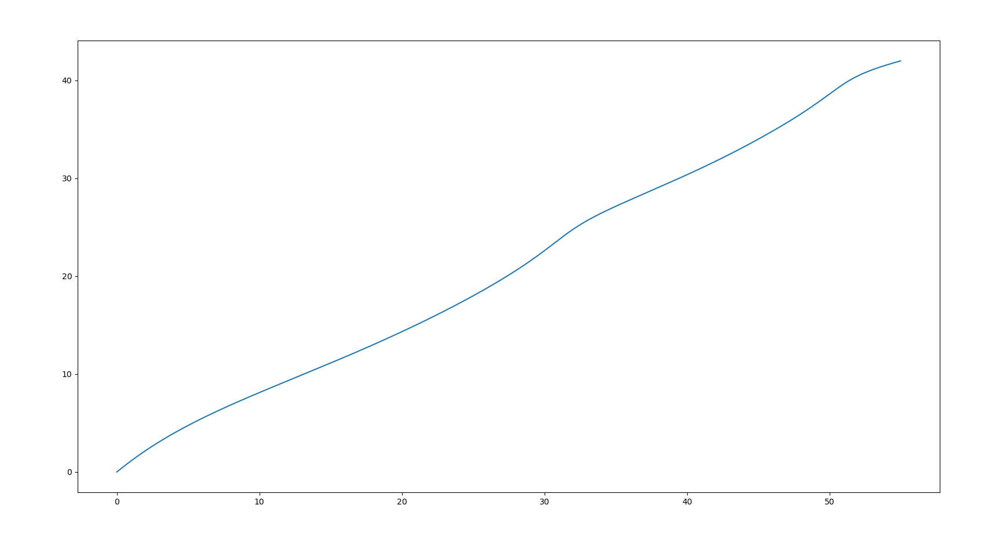
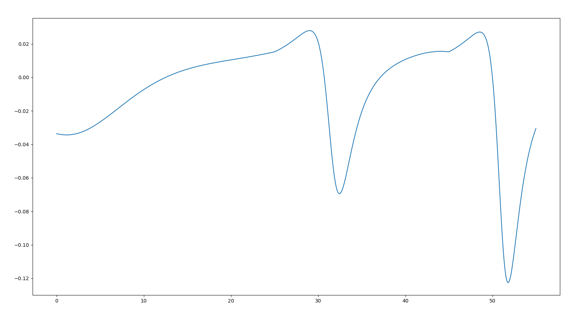

# multi_bezier_curve_smoothing_path
多段贝塞尔曲线平滑路径

一、概述：
    根据路径点个数的不同，使用五阶贝塞尔曲线拼接五阶贝塞尔曲线，五阶贝塞尔曲线拼接三阶贝塞尔曲线。在后段曲线的控制点中引入一个辅助控制点，来使后段曲线在与前段曲线的连接处满足G0连续、G1连续、G2连续。

    G0连续： 前一段曲线的末点与后一段曲线的起点重合
    G1连续： 连接处的切线-一阶导数连续
    G2连续： 连接处的斜率连续

二、示例

路径：五阶拼五阶拼三阶

三、使用方法

    封装为一个Bezier类

    XY q2{30,25};
    XY q3{35,27};
    XY q4{40,30};
    XY q5{45,34};

    XY a2{75,54};
    XY a3{80,60};
    XY a4{85,64};
    XY a5{90,68};
                    

    std::vector<XY> points{q2, q3,q4,q5,a2,a3,a4,a5};

    Bezier bezier(points);

    std::vector<Path> smoothpath = bezier.Smooth();

    git clone 
    cd 
    mkdir build && cd build
    cmake ..
    make

//TODO
G4连续：连接处的曲率的变化率连续，且曲率无大的突变。# multi_bezier_curve_smoothing_path
